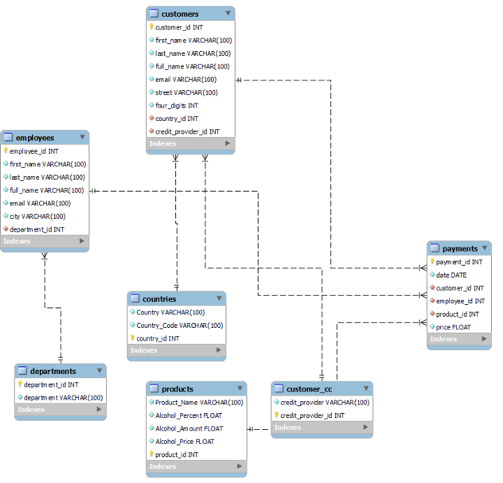
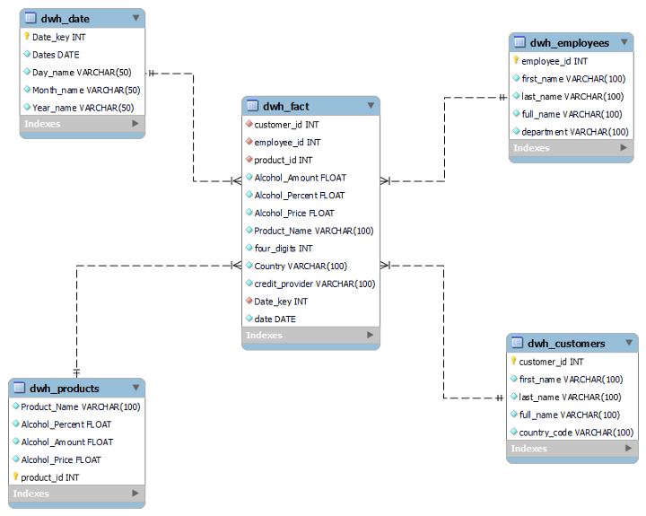

# Data-Engineering-Retail-Analytics
In this project, I created an __entire data architecture__ for a whiskey retail shop that will enable shop managers to make decisions based on their data. 
This project will simulate the entire process that data-driven companies do to make data-based decisions.

__The project will include Web Scraping, processing and transforming data, loading and designing a Database and a Data Warehouse, and finally, analysis and descision making.__

## Project Architecture


## Part 1 - Web Scraping
In this part I web scraped whisky product data from https://www.thewhiskyexchange.com/.

Run this to apply the code:

```
# Import the whisky_web_scraping class
from Helper import whisky_web_scraping

# Create a scraper object
scraper = whisky_web_scraping()

# Scrape Data
data = scraper.scrape_whisky(number_of_pages=5)
```

### End Result - Part 1 - Scraped Data

1. Panda's DataFrame with product data:
```
|    |Product_Name                                     |Alcohol_Percent  |Alcohol_Amount|Alcohol_Price|
|----|-------------------------------------------------|-----------------|--------------|-------------|
|0   | Deanston 18 Year Old                            |46.3             |70            |63.95        |
|1   |Lagavulin 2006 Distillers Edition                |43               |70            |89.95        |
|2   |Benromach Cask Strength Vintage 2010             |58.5             |70            |51.95        |
|3   |Personalised Highland Special Reserve Single Malt|48               |70            |54.95        |
|4   |Blair Athol 12 Year Old                          |43               |70            |48.45        |
|    |...                                              |...              |...           |...          |
|4441|Amrut Indian Single Malt Whisky Tasting Set      |49.6             |18            |44.95        |
|4442|Paul John Mithuna Sample                         |58               |3             |15.95        |
|4443|Milk & Honey Peated Cask Sample                  |46               |3             |5.75         |
|4444|Kavalan Bourbon Oak Sample                       |46               |3             |7.75         |
|4445|Kavalan Sherry Oak Sample                        |46               |3             |8.75         |
```

2. Exported CSV files of each type of Whisky:


**********************************************************************************************************************************
**********************************************************************************************************************************
**********************************************************************************************************************************

## Part 2 - Loading the Data and Designing a Database
In this part, I generated data about the whisky restail shop, designed a Central RDBMS, applied normalization to the data and loaded it.

### Applying the code
1. Generate Random Data

```
python3 2-Load/generate_store_data.py
```

2. Design the Database

- Current Schema:


- Run this to design and normalize the data
```
python3 2-Load/normalize_data.py
```

3. Load the Data to MySQL
```
python3 2-Load/load_data.py
```

### End Result - Part 2 - Finished Database Schema
All the Data is now stored in MySQL.



**********************************************************************************************************************************
**********************************************************************************************************************************
**********************************************************************************************************************************

## Part 3 - Designing a Data Warehouse
In this part, I will design a Data Warehouse which will be the main analytic focal point of the company. 

## Applying the code

### In Python - Generate the Date Dimension

```
python3 3-Data-Warehouse/generate_date_dimension.py
```

### In MySQL - Generate Dimensions & Triggers

```
generate_customers_dimension.sql
generate_employee_dimension.sql
generate_product_dimension.sql
generate_fact_table.sql

triggers.sql
```
### End Result - Part 3 - Finished Data Warehouse Schema



**********************************************************************************************************************************
**********************************************************************************************************************************
**********************************************************************************************************************************

## Part 4 - Analyzing the Data
In this part, ill get into the shoes of the analysts in the company and analyze the data in the Data Warehouse.

### Applying the code
```
python3 4-Analytics/analyze_data.py
```

### End Result - Part 4 - Analysis

1. Q1 — Which types of whisky produce the most profit?


2. Q2 — Which types of whisky people usually buy?


3. Q3 — Are there any interesting patterns as to when customers like to buy whiskey? If so what are they?


4. Q4 — Are we growing as a company in terms of profits or not?


5. Q5 — From which countries do most of the customers come from

